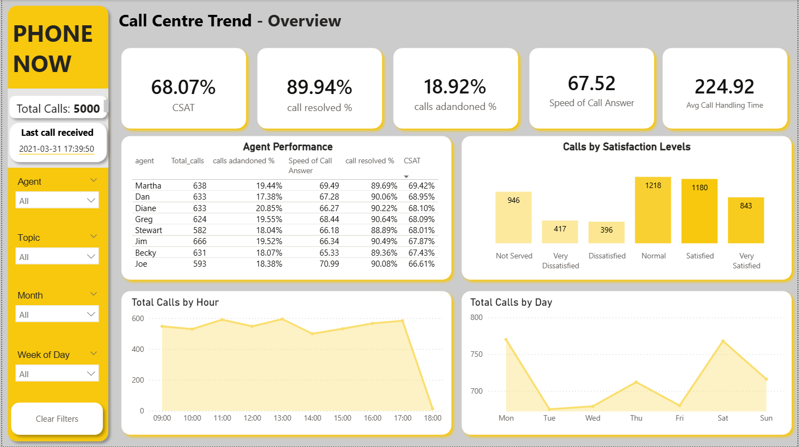

# Phone Now (Call centre) Calls Trend Analysis using Power BI
This project analyse the overall call trend in Phone Now using Power BI dashbaord. 
The propose of the project is to create an informative dashboard to support management operational planning and staff optimisation 
# Objectives
The main objectives for this project is to identify call volume patterns, peak hours, and service workload distribution
to help management optimize staffing decisions and improve call centre efficiency.

According to the report manager, Claire, this dashbaord should include following information:
- Identify customer and agent behavior performance
- Summary overall performance of call centre to management
Detail requirements and analysis can be found in [PwC case 2 business requirements.pdf](https://github.com/tzuyuliu123/PowerBI-Call_centre_trends/blob/main/PwC%20case%202%20business%20requirements.pdf)
# Dataset
The dataset is provided from Pwc Switzerland Power Bi Job Simulation on Forage (Task 2). 
It contains 5000 rows and 9 columns, where each row represent a single customer call. 
The dataset includes detailed call information such as call topic, whether the call was answered by an agent, call handling time, and customer satisfaction.
## Key Variables
- **Call ID**: Unique identifier for each call  
- **Agent**: Agent who handled the call  
- **Date / Time**: Timestamp of the call  
- **Topic**: Reason for the customer call  
- **Answered (Y/N)**: Indicates whether the call was answered by an agent (Y indicates answered / N represents Not answered)
- **Resolved**: Indicates whether the issue was resolved  
- **Speed of Answer (seconds)**: Time taken for an agent to answer the call  
- **Average Talk Duration**: Duration of the call  
- **Satisfaction Rating**: Customer satisfaction score (scale: 1-5) after the call

# Key KPIs & Insight 
- Customer Satisfaction
- Call resolved %
- Call Adandoned %
- Speed of call answer
- Average Call Handling Time
## Insights
- **Overall Performance**
  
  From January 2021 to March 2021, overall customer satisfaction declined steadily. The underlying cause cannot be determined from the current dataset and requires further analysis. However, this decline is unlikely to be driven by increased call volume, as the total number of calls decreased over the same period.
- **Customer Behaviour Perspective**

  Customers tend to call more frequently on Mondays and Saturdays. On a typical day, there are three peak call hours: 11:00 AM, 1:00PM, and 5:00 PM. Call reasons are relatively evenly distributed across the five main categories and over 85% of calls are successfully resolved regardless of call topics.
  However, it is noticeable that the overall call centre adandoned call rate remains relatively stable at around 19% over time. This indicates that approximately one in five customer calls are not successfully handled each month. 
  If decreasing the number of not answered calls aligns with current organisational objectives, it is recommended to hire one more phone staff. 
- **Agent Performance Perspective**

Overall, agent performance remains strong, with all staff delivering a high standard of service.
The top five agents by customer satisfaction are Martha, Dan, Diane, Greg, and Jim.
Notably, calls related to streaming issues have the lowest resolution rate among all call topics.
This suggests an opportunity to improve service quality by enhancing agent training or allocating
additional resources to support streaming-related inquiries.
 # Dashboard
Below is a snapshot of the Power BI dashboard developed for this project:

